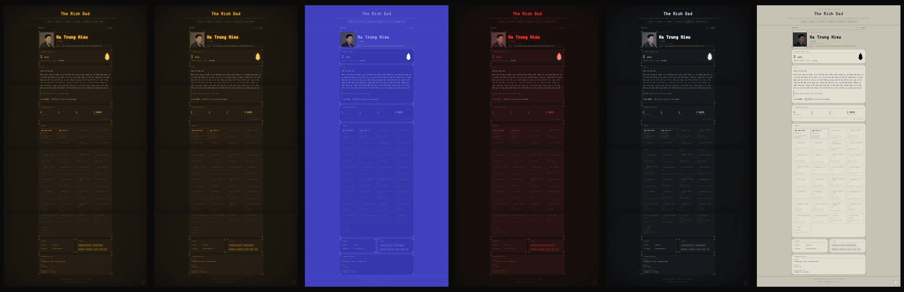

# LazyBlog

[](https://github.com/hieuha/LazyBlog/releases/latest)
[](LICENSE)
[](composer.json)

> A markdown-first personal blog with CRT phosphor aesthetics,
> operator-flex gamification, and zero moving parts.

**Static. Markdown. Plain PHP.** Posts live as `YYYY-MM-DD-slug.md`
files on disk — no database, no framework, no build step. A few
thousand lines of plain PHP render them through a Caddy + php-fpm
stack you can deploy to a 5 USD VPS (or a Raspberry Pi) in under a
minute.

**AI-friendly by design.** Every post is also served as raw `.md` at
`/posts/{slug}.md`. The site publishes [`llms.txt`](https://llmstxt.org)
as a three-section index — `## Posts` (each with a short summary),
`## Series` (multi-part collections with manifest descriptions), and
`## Tags` — so language models and tooling can ingest a sectioned
catalogue of the entire blog without scraping HTML. Valid RSS 2.0 too
— and an `article:published_time` that carries full ISO datetime
precision when you bother to set it.

**Operator-flex `/about` page.** A Duolingo-style streak flame tracks
your writing cadence — day, week, month, or year, you pick. A
JSON-driven badge catalogue at `content/badges.json` covers post-count
milestones, markdown-element patterns (image-rich, code-heavy,
link-curator), tag specialisation, time-of-day Easter eggs (night owl,
lunch break, Friday night transmission), calendar anniversaries, and
multi-year streaks — 13 reusable kinds, 30+ shipped entries, edit in
place. Hidden badges only appear in the HTML once unlocked, so the
surprise survives a "view source" peek.

**Rich media in markdown.** `` (or a bare URL on its
own line) auto-renders as a `<video>` player — `#bg` opts into
Hermes-style autoplay loop muted ambient. Adjacent `` lines
collapse into a CSS Grid gallery (`count-2` through `count-6`) with
title-attribute captions. YouTube URLs still auto-embed as iframes.

**Series with halftone-dot covers.** A multi-part series (any post
with `series: my-slug` in its frontmatter) shows up at `/series` and
`/series/{slug}` — and now carries a manifest sidecar
(`content/series/{slug}/manifest.json`) with editorial title +
description + cover image. Cover uploads are center-cropped to 600×600,
run through a deterministic 4×4 ordered-Bayer dither (built from
primitive Imagick composite + threshold ops so the output is bit-identical
across IM6/IM7/Alpine/brew, sidestepping the `thresholds.xml` lookup that
Ubuntu's apt build silently no-ops on), and saved as a
transparent-where-light WebP that CSS `mask-image` + `currentColor`
tints with the active theme — phosphor amber, green, crypt red,
violet p7, electric p11, whichever. No cover yet? `/series` cards still fall back
to the QR + greek-glyph stamp. The admin canvas at `/admin/series`
lists every discovered series with manifest + cover state and supports
editing metadata, **renaming the slug** (bulk-rewrites every matching
post's frontmatter atomically + moves `content/series/{slug}/`), and
**attaching arbitrary posts** to the series via native HTML5 datalist.
Social meta on `/series/{slug}` carries the cover as `og:image` so
Telegram / X / Slack link previews show the dithered art. The
post editor's `series:` field is now a `<datalist>` autocomplete of
every existing slug. ext-imagick is a soft dep — title + description
still save without it; only cover upload is gated. See
`docs/writing-posts.md` → "Series management".

**Opt-in plugins.** Drop a folder into `plugins/{slug}/`, set
`PLUGINS=slug` in `.env`, and the site picks up a new page, header
link, and (optionally) admin section — without touching core. Each
plugin is self-contained (manifest, PSR-4 source, views, route-scoped
CSS/JS, private storage under `content/plugins/{slug}/`) and gets a
type-safe `App\Plugin` interface to register public routes, nav links,
assets, and `/admin/{slug}/*` pages (auto-wrapped with
`Auth::requireAuth()`). Reserved core paths can't be claimed; a broken
plugin logs + skips without taking the site down; strict CSP stays
intact. Ships with `plugins/hello-world/` as the reference,
`plugins/graffiti/` for cross-blog sticker / spray-paint exchange
between LazyBlog friends (energy ledger, federated handshake,
magic-link cross-blog spray, symmetric revoke — see
`plugins/graffiti/README.md`), and `plugins/stalk/` for a pull-only
LazyBlog feed reader at `/stalk` (operator pastes friend blog URLs,
plugin validates `<generator>LazyBlog</generator>` on `/feed.xml`, polls
every 3h/10h/1d, shows top-N newest posts per friend — see
`plugins/stalk/README.md`). Empty `PLUGINS=` is a no-op. See
`docs/plugin-development.md`.

**Passwordless admin login (FIDO2 / WebAuthn).** Set `WEBAUTHN=true`
in `.env` and `/admin/login` swaps the password form for a single
`fa-fingerprint` tap-key button — wave a Yubikey, Touch ID, or any
FIDO2 authenticator and you're in. Multi-credential by default:
register a primary + backup at `/admin/security` (operator-named
nicknames, status pills mirroring the post list, REVOKE confirm
dialog matching the DEL-post pattern). Bootstrap fallback: when
`WEBAUTHN=true` but no keys are registered yet, the page still shows
the password form with a dim hint so the first registration cannot
lock you out. SSH break-glass works too — delete
`content/admin/webauthn-credentials.json` or flip the env back to
`false`. The per-IP brute-force throttle (10/15min, same one shared
with password login) covers failed assertions, the signature counter
is verified monotonic, CSRF is required on every endpoint, and origin
binding makes a cloned phishing `/admin/login` useless because the
authenticator refuses to sign for it. The Relying Party ID auto-pins
to the request host but you can lock it to a single hostname via
`WEBAUTHN_RP_ID=` when migrating domains. Full operator guide:
`docs/webauthn-passwordless-login.md`.

**Password-protected posts.** Lock a single post behind a per-post
password without touching the rest of the editor flow. Set it in the
admin editor with one click ([ Set Password ] / [ Remove Password ]
side-channel buttons — no save-post round trip); the password is
bcrypt-hashed into the YAML frontmatter as `password_hash:`. Visitors
land on an "ACCESS RESTRICTED" HUD form (theme-colored, terminal
aesthetic) instead of the body; the correct password sets a session
flag and unlocks for the rest of that browser session. Wrong-password
state shakes the panel red and shows attempts-left; 10 failures in a
sliding 15-min window throttle the IP and disable the field
(`TRUST_CF_CONNECTING_IP=true` switches the IP source to the
`CF-Connecting-IP` header when traffic actually flows through
Cloudflare). Listings prefix the title with a bare Font Awesome
padlock (`fa-lock` locked, `fa-unlock-keyhole` once the visitor has unlocked
this session) that tints with the active theme via `currentColor`, so
the operator can see at a glance which posts are gated. Set / Update
/ Remove all flash inline feedback above the form (`// Password set.`,
`// Password updated.`, `// Password removed.`); the password field
validates `>= 4` chars in the browser before any round trip. Raw `.md`,
`/llms.txt`, and `/feed.xml` exclude protected posts
entirely (anonymous 404 on the `.md` endpoint;
unlocked-session readers and admins get the markdown back with the
`password_hash:` line stripped). Search still surfaces title + tag
matches with a `// protected post` snippet but never indexes the body.
See `docs/writing-posts.md` → "Password-protected posts".

**Zen Writer Mode.** A fullscreen distraction-free editor at `/writer`
(also reachable from any post via the `[ ZEN ]` button — admin only).
Inspired by iA Writer: large `Play` typography, typewriter focus
(active paragraph at full opacity, previous paragraphs dimmed),
typewriter scrolling (caret stays vertically centred). Live markdown
render keeps syntax markers visible while the block is being edited
and collapses them to a screen-reader-only sliver the moment focus
leaves — so heading hashes, emphasis stars, and image URL noise vanish
once the writer moves on but reappear the instant they click back in.
Keyboard-first: `Ctrl/Cmd + S` save, `Ctrl/Cmd + Enter` publish (with
confirm step on first publish, single-press SAVE on live updates),
`Ctrl/Cmd + B/I/K` wrap selection in bold/italic/link (Cmd+K opens a
styled URL prompt), `Ctrl/Cmd + ]` toggles a side outline panel
auto-built from h1–h4 headings. Paste an image from the clipboard
and it uploads through `/admin/upload` and inserts `` at the
caret — same WebP re-encode + EXIF strip as the normal upload path.
Auto-saves every 700ms to `localStorage` (per-slug when editing) and
restores on next visit; the title prompt pre-fills from the document's
first sentence with all markdown decoration stripped. Light/dark
surface toggle for sunlight legibility while still tinting headings,
emphasis, and image overlays with the active theme's `--primary`.
IME-safe for Vietnamese Telex (composition events guard every
re-render). Drafts redirect to `/admin/edit/{slug}`; publishes go to
the live `/posts/{slug}`. See `docs/writing-posts.md` → "Zen Writer
Mode".

**Hardened, ergonomic.** CSP (incl. `media-src`), CSRF, atomic file
writes, session hardening, scheme-whitelisted image URLs. Stylesheets
split by concern and cache-busted via `filemtime` so deploys
invalidate browser caches per-file without manual asset rotation.
Backup with `rsync`. Restore in seconds.

```
┌─────────────────────────────────────────────────────┐
│  CRT terminal layout  ·  6 phosphor themes          │
│  Phosphor vignette    ·  chromatic-aberration heads │
│  Markdown files       ·  llms.txt + raw .md + RSS   │
│  Sticky-section TOC   ·  code-block copy buttons    │
│  Browser admin UI     ·  EasyMDE + server-side prev │
│  Mobile mini-toolbar  ·  IME-safe phone editor      │
│  Zen Writer Mode      ·  iA-style typewriter focus  │
│  Image column-width   ·  duotone tint + hover-orig │
│  YouTube auto-embed   ·  .webm/.mp4 → <video>       │
│  Image gallery grid   ·  caption via title-attr     │
│  Plugins (opt-in)     ·  drop folder, set PLUGINS=  │
│  Series with covers   ·  Bayer-dither WebP + manifest│
│  Password-protected   ·  bcrypt + session unlock HUD │
│  Search + Archive     ·  reading-progress meter     │
│  SEO + JSON-LD        ·  Open Graph + Twitter Card  │
│  CSP + session hard.  ·  CSRF + atomic file writes  │
│  Writing streak card  ·  JSON-driven badge catalog  │
│  GFM tables           ·  admonitions + freq-tags    │
└─────────────────────────────────────────────────────┘
```

## Screenshots



_amber (default) · green · crypt red · brutalist mono · p7 violet · p11 electric blue — all swappable from the in-page theme picker._

## Stack

- PHP 8.2+ (no framework)
- Composer: `league/commonmark`, `symfony/yaml`, `vlucas/phpdotenv`, `chillerlan/php-qrcode`
- ext-imagick (optional — required only for series cover dither)
- Caddy + php-fpm
- Fonts via Google Fonts: VT323, Share Tech Mono, Play
- Docker Compose for local dev

## Quick start

**Local dev (Docker):**

```bash
cp .env.example .env
docker compose up -d --build
docker compose exec app composer install
open http://localhost:8080
```

**Local dev (no Docker):**

```bash
cp .env.example .env
composer install
php -S localhost:8000 -t public
```

**Production VPS (one-shot bare-metal install):**

```bash
# On Debian/Ubuntu/Raspbian (x86_64 or ARM) — run as root:
curl -fsSL https://raw.githubusercontent.com/hieuha/LazyBlog/refs/heads/main/scripts/install-vps.sh | sudo bash
```

(Interactive prompts read from `/dev/tty` so the curl-pipe pattern keeps
working. Prefer to read the script first? `curl -o install-vps.sh ... && sudo bash install-vps.sh`.)

The installer pins PHP 8.2, creates an isolated `lazyblog` system user,
drops a Caddy site on `:80`, sets up a daily backup cron, and prompts
for admin password + site title + URL + author + callsign + timezone.
See `docs/bare-metal-deployment-guide.md` for the manual step-by-step
playbook.

## Documentation

| File | Read when |
|------|-----------|
| `docs/writing-posts.md` | Authoring posts — frontmatter, admin UI, drafts, password-protected posts |
| `docs/markdown-syntax.md` | What renders inside post `.md` files |
| `docs/configuration.md` | `.env` variables + URL route reference |
| `docs/bare-metal-deployment-guide.md` | Manual VPS playbook (what `install-vps.sh` automates) |
| `docs/docker-deployment-guide.md` | Docker workflow — dev compose + production image |
| `docs/backup-and-restore.md` | Backup script, cron, restore drill |
| `docs/seo-and-social.md` | OG tags, JSON-LD, llms.txt, RSS, how to test link previews |
| `docs/security.md` | CSP, session hardening, production checklist |
| `docs/webauthn-passwordless-login.md` | FIDO2 / Yubikey / Passkey admin login — setup, recovery, threat model |
| `docs/system-architecture.md` | Request lifecycle, render pipeline, file layout |
| `docs/badges.md` | TX streak + customisable badge catalogue on `/about` |
| `docs/plugin-development.md` | Writing your own plugin — routes, nav, assets, admin, storage |

## Project layout (high level)

```
LazyBlog/
├── public/              # web root (front controller + assets)
│   └── assets/          # base/effects/components/post/pages.css + admin.css + admin-editor.js
├── src/                 # PHP — Router, Controllers, PostRepository, MarkdownRenderer, Http...
│   ├── Badges/          # gamification: BadgeKinds (compute templates) + BadgeRegistry (loader)
│   ├── Plugin.php       # plugin contract — implemented by each enabled plugin
│   ├── PluginManifest.php
│   ├── PluginContext.php       # stable API surface plugins receive
│   ├── PluginRegistry.php      # boot + dynamic PSR-4 + reserved-path collision check
│   └── Controllers/PluginAssetController.php  # /plugin-assets/{slug}/{file}
├── views/               # layout, post, home, tag, admin/*
├── plugins/             # opt-in plugin folders — PLUGINS=slug in .env enables them
│   ├── hello-world/     # canonical reference plugin
│   ├── graffiti/        # cross-blog sticker exchange (federated, energy economy)
│   └── stalk/           # pull-only LazyBlog feed reader at /stalk (top-N latest per friend)
├── content/             # markdown posts + about + badges.json (mostly gitignored)
│   ├── posts/           # YYYY-MM-DD-slug.md
│   ├── about.md         # /about page source
│   ├── badges.json      # streak + badge catalogue (allowlisted in .gitignore)
│   └── plugins/         # plugin-private storage (gitignored, backed up via rsync)
├── scripts/
│   ├── install-vps.sh   # one-shot bare-metal installer
│   ├── hash-password.php
│   └── backup-content.sh
├── tests/               # plain-PHP assertion fixtures (no PHPUnit)
│   ├── test-gamification.php   # streak math
│   ├── test-plugin-system.php  # plugin registry + manifest + asset matcher
│   ├── test-plugin-events.php  # post.save event broadcast to plugins
│   ├── test-graffiti-*.php     # graffiti plugin: boot, friends, inbox,
│   │                           # energy, outbox, rate-limit, moderation, render
│   └── test-stalk-*.php        # stalk plugin: friend-store, post-cache, config,
│                               # feed-parser, refresh-service, boot
├── docs/                # detailed docs (see table above)
├── Caddyfile.example    # production HTTPS site block
├── docker-compose.yml   # dev: Caddy + php-fpm bind-mount
├── Dockerfile           # dev image
├── Dockerfile.prod      # production: non-root, opcache, no bind mount
├── composer.json
└── .env.example
```

For the full file-by-file breakdown see `docs/system-architecture.md`.

## License

MIT.
